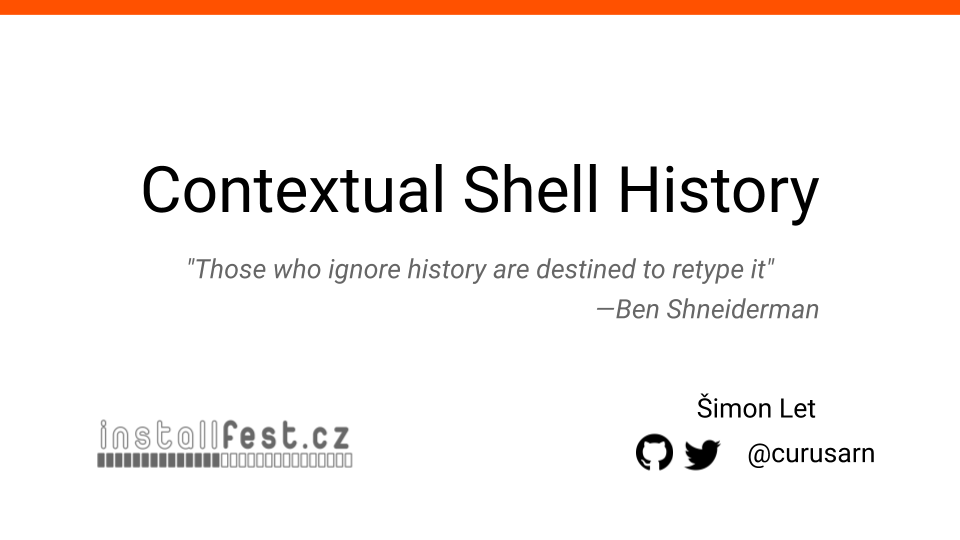
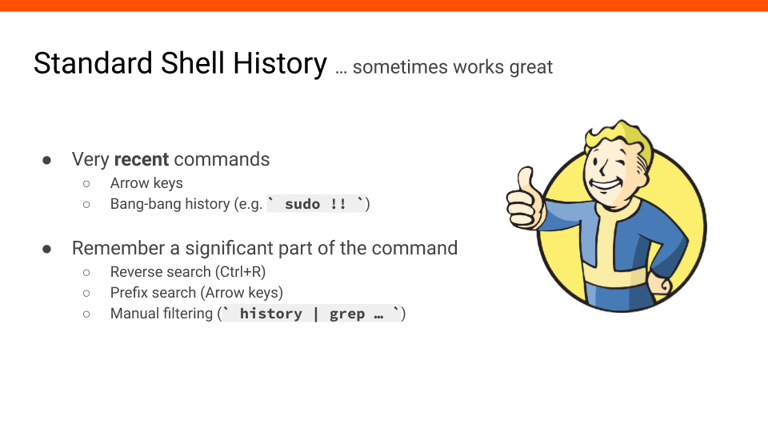
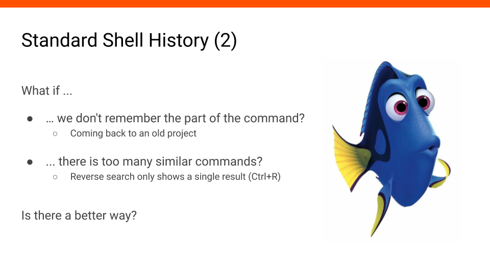
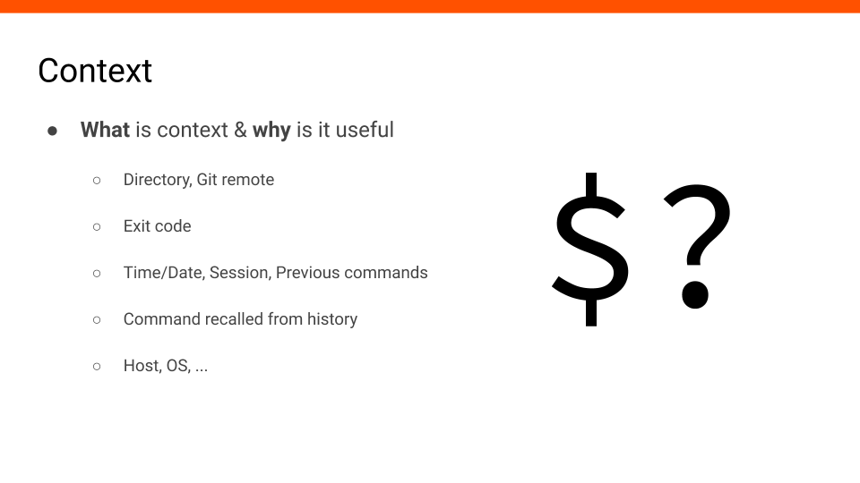
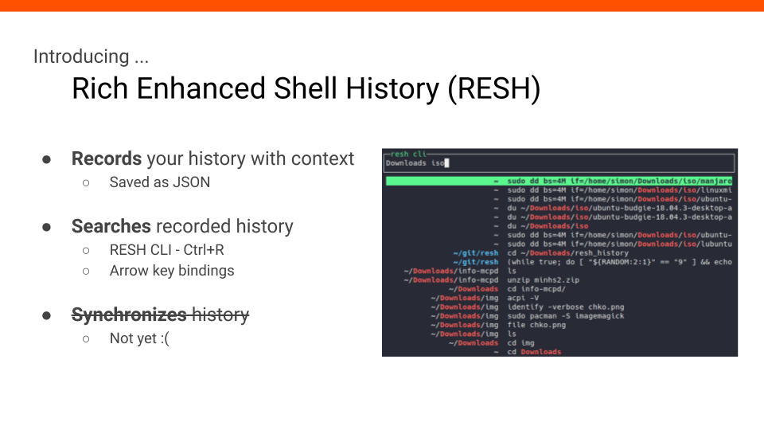
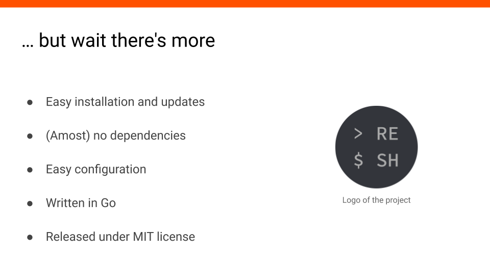
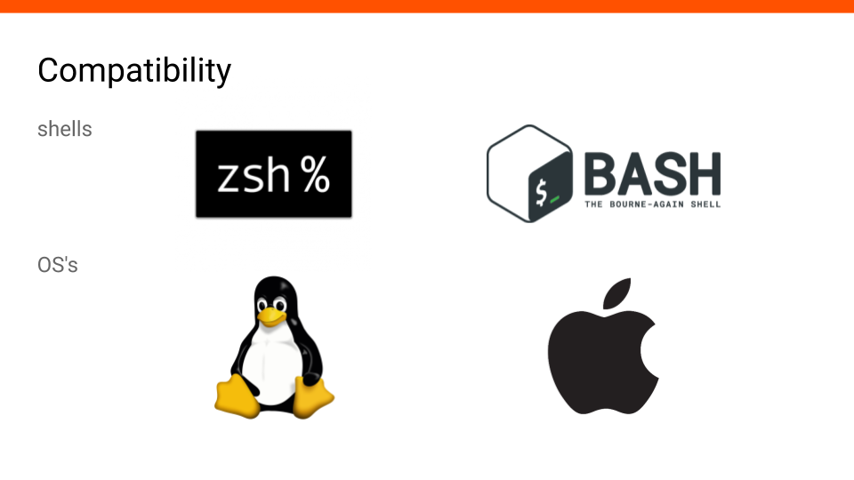
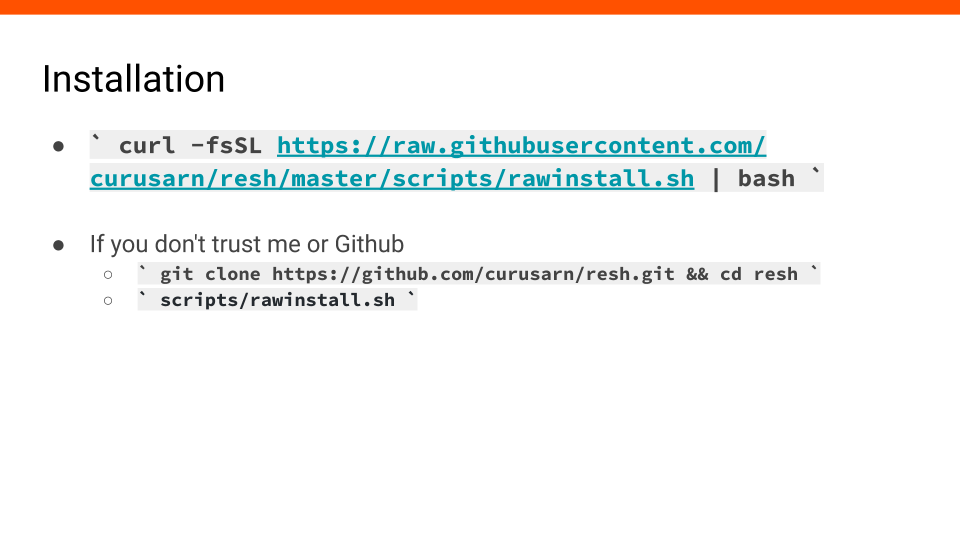
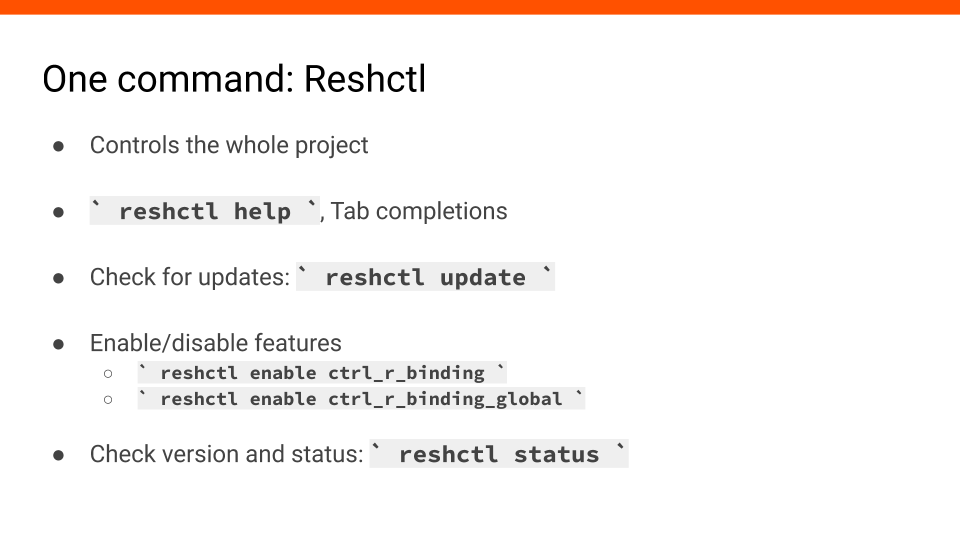
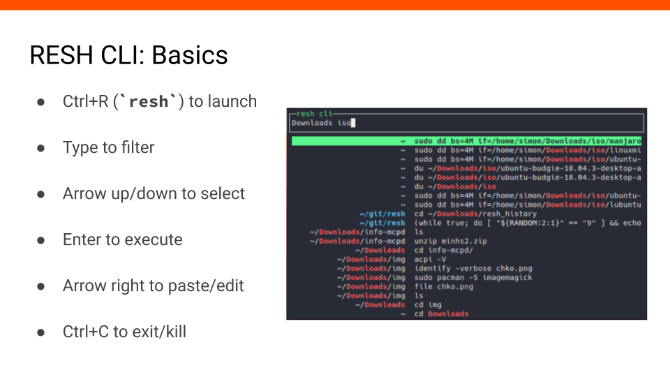

# Contextual Shell History

29.2.2020 @ [Installfest](https://installfest.cz/if20/)

**#1** Today I would like to tell you something about contextual shell history.

**#2** First, we will look at standard shell history and more specifically we will talk about when it works great.

Standard history works great when we need commands we executed recently.
Typically, we make a typo, press arrow up, correct ourselves and execute theh result - works great.
Another example is when we need to alternate between two or three different commands - pressing arrow up a couple of times comfortably gives previous commands without much effort and typing.

History also works well when we have a good idea what we are looking for and remember a significant part of the command we want to recall.
For example, we can press Ctrl+R, type big enough part of the command and execute the result.
Similarly, we could use prefix search if we do have it enabled or we could use more advanced manual history filtering to get find what we need.

**#3** We just talked about how standard history works
great when we know what we are looking for.
But what if we don't remember enough?
For example, when we come back to an old project we might not remember what commands we used there before.

Another situation when history doesn't work great is when we do remember a part of the command but there are many other similar commands.
We press Ctrl+R, type the query and then we need to press Ctrl+R repeatedly to get to the desired result while only seeing one command from the history at a time.

Is there something we can do about this? What if we didn't rely on just the text of the command and had more than that in our shell history?

**#4** We can record context to the shell history. Let's break down what is context and why is it useful.

Directory where we executed the command and the git repository is useful because you probably use different command based on what directory or project you are currently in.

Commands with non-zero exit codes are likely errors so we probably don't want to run them again.

Both time/date and session can provide a meaningful way to group shell history records together.
Session can be a single terminal window or we could be smarter and group terminal windows together based on time.

If we start looking at history as sequences of commands instead of single commands we could find interesting relationsihps between them.
For example, after `git add ....` commands we might often use `git commit ...` commands.

The fact if the command was recalled from history or typed out is also an important part of context. For example, there could be commands that we use often but we type them out every time. In contrast, there could be commands that we want to recall from history every time we use them.

The last bullet point is an additional context that could be useful if we start sychronizing history between multiple devices.
Benefits of synchronizing shell history are having all ao it avalable and not loosing any during reinstalls or accidents.

**#5** I would like to introduce my project - Rich Enhanced Shell History.

It records your history with context and saves it as JSON (for now).

It allows you to search the history in two ways.  
First, there is a CLI application that you can see in the slide and you will see more of it in a little bit.
This app is designed to be bound to Ctrl+R and to replace standard reverse search.  
Second, it provides standard arrow keybindings that step through recent history and do prefix search.

Another feature I really want in this project is synchronization.
Technically, it's not a big issue - I just haven't got around to do it yet.

**#6** There are other things I would like to highlight about the project.

The installation and updates are easy. There are almost no dependencies. It's easy to configure or at least I think so. It's written in Go and it's opensource.

**#7** It's compatible with zsh and bash. And it runs on Linux and MacOS.

**#8** Let's move on to more practical part of this talk.
There is a simple way to install this project using this oneliner.

`curl -fsSL https://raw.githubusercontent.com/curusarn/resh/master/scripts/rawinstall.sh | bash`

I know what you are thinking - if you don't trust me or Github you can download or clone this, check the script and run it afterwards.

<iframe width="560" height="315" src="https://www.youtube.com/embed/KAZyEf4tR18" frameborder="0" allow="accelerometer; autoplay; encrypted-media; gyroscope; picture-in-picture" allowfullscreen></iframe>

**#9** This is how installation looks like.

First, the installation script finds the latest version on Github and downloads the correct archive based on your OS and architecture - Linux and 64bit in this case.

Then, the script checks what is your login shell and if you have recent enough version of it. After that, files are copied and some additional setup is performed.
  

**#10** TODO: Single command to rule them all

**#11** TODO: RESH CLI basic controls
