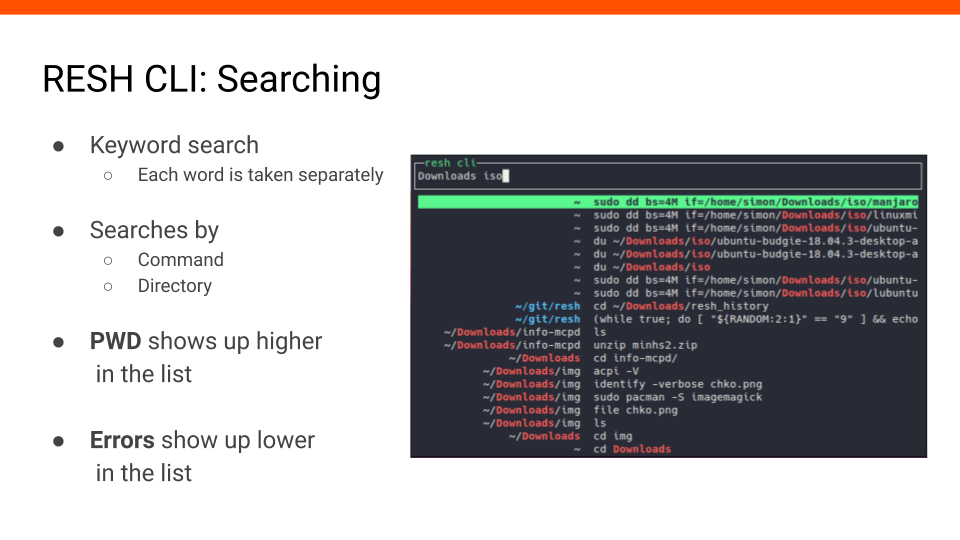
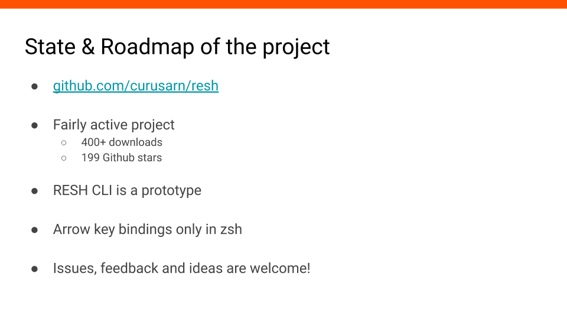
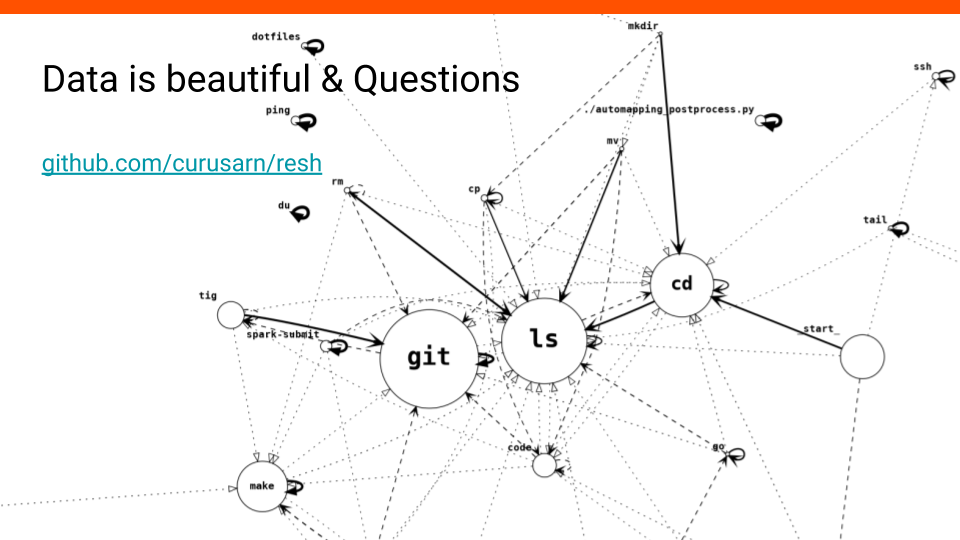

# Contextual Shell History

29.2.2020 @ [Installfest](https://installfest.cz/if20/)

**#1** Today, I would like to tell you something about contextual shell history.

**#2** First, we will look at standard shell history, and more specifically, we will talk about when it works great.

Standard history works great when we need commands we executed recently.
Typically, we make a typo, press arrow up, correct ourselves, and execute the result - works great.
Another example is when we need to alternate between two or three different commands - pressing arrow up a couple of times comfortably gives previous commands without much effort and typing.

History also works well when we have a good idea of what we are looking for - when we remember a significant part of the command we want to recall.
For example, we can press Ctrl+R, type big enough part of the command, and execute the result.
Similarly, we could use prefix search (if we do have it enabled), or we could use more advanced manual history filtering to find what we need.

**#3** We just talked about how standard history works
great when we know what we are looking for.
But what if we don't remember enough?
For example, when we come back to an old project, we might not remember what commands we used there before.

Another situation when history doesn't work great is when we do remember a part of the command, but there are many other similar commands.
We press Ctrl+R, type the query, and then we need to press Ctrl+R repeatedly to get to the desired result while only seeing one command from the history at a time.

Is there something we can do about this? What if we didn't rely on just the text of the command? What if we had more than text in our shell history?

**#4** We can record context when executing commands and then store it in our shell history. Let's break down what context is and why it's useful.

Directory, where we executed the command, and the git repository is useful because you probably use different commands based on what directory or project you are currently in.

Commands with non-zero exit codes are likely errors, so we probably don't want to run them again.

Both time/date and session can provide a meaningful way to group shell history records together.
A session can be a single terminal window, or we could be smarter and group terminal windows together based on time.

If we start looking at history as sequences of commands instead of single commands, we could find interesting relationships between them.
For example, after `git add ...` commands we might often use `git commit ...` commands. The sequentiality of commands is also a part of the context.

The fact whether the command was recalled from history or typed out is also an important part of the context. For example, there could be commands that we use often but we type them out every time. In contrast, there could be commands that we want to recall from history every time we use them.

Host and OS provide additional context that could be useful if we start sychronizing history between multiple devices.
Benefits of synchronizing shell history include having all of it available on any device and not losing any during reinstalls or accidents.

**#5** I would like to introduce my project - Rich Enhanced Shell History.

It records your history with context and saves it as JSON (for now).

It allows you to search the history in two ways.  
First, there is a CLI application - you can see it in the slide, and you will see more of it in a little bit.
This app is designed to be bound to Ctrl+R and to replace standard reverse search.  
Second, it provides standard arrow keybindings that step through recent history and do prefix search.

Another feature I really want in this project is synchronization.
Technically, it's not a big issue - I just haven't got around to do it yet.

**#6** There are other things I would like to highlight about the project.

The installation and updates are easy. There are almost no dependencies. It's easy to configure (or at least I think so). It's written in Go, and it's opensource.

**#7** It's compatible with zsh and bash. And it runs on Linux and MacOS.

**#8** Let's move on to the more practical part of this talk.
There is a simple way to install this project using this oneliner.

`curl -fsSL https://raw.githubusercontent.com/curusarn/resh/master/scripts/rawinstall.sh | bash`

I know what you are thinking - if you don't trust me or Github you can download or clone this, check the script and run it afterward.

<iframe width="560" height="315" src="https://www.youtube.com/embed/KAZyEf4tR18" frameborder="0" allow="accelerometer; autoplay; encrypted-media; gyroscope; picture-in-picture" allowfullscreen></iframe>

**#9** This is how installation looks like.

*NOTE: This and all the other videos are kinda slow so feel free to read the text while watching.*

First, the installation script finds the latest version on Github and downloads the correct archive based on your OS and architecture - Linux and 64bit in this case.

Then, the script checks what is your login shell, if you have a recent enough version of bash and zsh. After that, files are copied, and some additional setup is performed.
  

**#10** I've set out to make this tool easy to use and configure. That's why I created a single command to control the whole project.

This single command is `reshctl` (resh control). It has help and tab completions.

You can use `reshctl` to update the project, enable/disable features, find out what version you are running, see what features are enabled, and more.

**#11** The part of this project I want to show you the most is RESH CLI.

It's a command line application that shows you a page of records from history and let's you search by command and directory. Records are filtered as you type.

You can launch it using Ctrl+R or alternatively using the command `resh`.

I will show you the rest of the controls in the video on the next slide.

<iframe width="560" height="315" src="https://www.youtube.com/embed/Pj4u1yz3hsw" frameborder="0" allow="accelerometer; autoplay; encrypted-media; gyroscope; picture-in-picture" allowfullscreen></iframe>

**#12** First, we press Ctrl+R to launch the app.

We start typing, and the results are being filtered by directory (left) and the command itself (right).

We use arrow up/down keys to select records.

We could use Enter to execute selected command.

We will press arrow right to paste the selected command onto the command line.
Now we can edit the command and execute it.

**#13** I mainly wanted to show you the controls in the previous video. Now I will explain how the search works in detail.

Each word of the query is taken separately - the order doesn't matter.
This means that each keyword can match either command, directory, or both.

There are a few more things that affect the order of results.
Commands from the current directory are prioritized, and any commands with non-zero status are penalized.

<iframe width="560" height="315" src="https://www.youtube.com/embed/5jF35mLxgcU" frameborder="0" allow="accelerometer; autoplay; encrypted-media; gyroscope; picture-in-picture" allowfullscreen></iframe>

**#14** We start by changing our directory and then we press Ctrl+R to launch RESH CLI.

Before we type anything, we see that there are only results from the current directory - the current directory is highlighted with blue color.

Once we type in the query, we get a mix of records from the current directory and other directories.

When we change the query to something specific enough, we see that results from the current directory disappear completely.

<iframe width="560" height="315" src="https://www.youtube.com/embed/-hfuRjNpL3w" frameborder="0" allow="accelerometer; autoplay; encrypted-media; gyroscope; picture-in-picture" allowfullscreen></iframe>

**#15** In this video I want to show you how RESH CLI handles records with non-zero exit status.

Let's say we want to write an iso file onto a flash drive using the `dd` command. After we type the query we see that the first four results are indeed `dd` commands. We can also see that only the last one of these for commands doesn't start with `sudo`.

This might seem random, but if we execute the command, it's going to give us an error, which is why it was listed last.

<iframe width="560" height="315" src="https://www.youtube.com/embed/i_o66pndEvE" frameborder="0" allow="accelerometer; autoplay; encrypted-media; gyroscope; picture-in-picture" allowfullscreen></iframe>

**#16** I have prepared one more example. I think this one is a little bit more practical. Imagine you are coming to an old project, and you have no idea what commands you ran the last time you worked on it.

First, we change into the project directory. We launch the RESH CLI, and we see all the commands we used in the project before.

We can see that there is a `make` command in the history, so we will run that.

This is not particularly impressive; we could have found out that there is a `Makefile` by simply listing the contents of the directory.

Now we launch RESH CLI again and select a different command. Then we make some edits and execute it from the command line.

Imagine if we used `Makefile` instead of RESH CLI. We would have to open the file, edit it, and then finally run `make` - history is quite useful and comfortable in situations like this one.

**#17** What are the state and future plans for the project?

It's unlikely that you will encounter major errors if you install the project - a couple hundred people have already installed it.

You can head over to [github.com/curusarn/resh](https://github.com/curusarn/resh) to find installation instructions, more information, and what features you can expect in the future.

RESH CLI, the command line app I was showing you today, is a prototype - it only contains the absolute minimum of features.
For example, it only uses directory and command for searching.
It doesn't show you which commands have non-zero exit status. RESH CLI app is meant to be transparent and predictable because unpredictable tools are hard to use.

Another thing I need to point out is that the arrow key bindings are only enabled by default in zsh because they are slow in bash.
The way how bash implements support for binding custom functions is weird and slow.

Please create issues if you have any feedback, suggestions, or if you run into problems!

**#18** One more thing I want to show you is how contextual history can be used to create nice graphs. This graph shows that my most used command is `git` and that almost every `mkdir` is followed by `ls`.

You might want to install this project if you like playing around with data.

If you liked what you saw during this presentation and want to try out the project:

1. Install the project: [github.com/curusarn/resh#Installation](https://github.com/curusarn/resh#Installation)
1. Restart your terminal
1. Try RESH CLI: `reshctl enable ctrl_r_binding` (enables Ctrl+R binding for current shell session)
1. If you like RESH CLI enable it for future shell sessions: `reshctl enable ctrl_r_binding_global`
